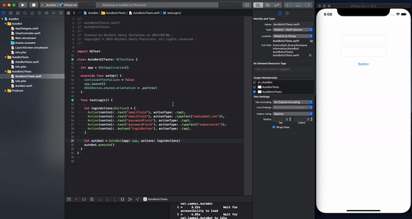

[](https://travis-ci.org/michaelhenry/AutoBot)
[](https://cocoapods.org/pods/AutoBot)
[](https://cocoapods.org/pods/AutoBot)
[](https://cocoapods.org/pods/AutoBot)

# AUTOBOT

A Tool for QA Testers and Developers.

Testers could create test cases from Admin page
while Developers could fetch and execute it inside the XCode UITesting via API automatically using CI.

## Sample IOS Test Cases

In the screenshot above, the code was executed like this, so imagine, this is `Codable`, we can just fetch this from any server and/or any file.

```swift
import XCTest

class AutoBotUITests: XCTestCase {

  let app = XCUIApplication()
  var autobot:AutoBot!

  override func setUp() {
    continueAfterFailure = false
    app.launch()
    XCUIDevice.shared.orientation = .portrait
    autobot = AutoBot(app: app)
  }

  func testLogin() {
    let loginCommands:[Command] = [
      .action(.tap, for: .text("emailField")),
      .action(.typeText("me@iamkel.net"), for: .text("emailField")),
      .assert(.isEnabled(true), for: .text("emailField")),
      .assert(.isExists(true), for: .text("emailField")),
      .assert(.textValue("me@iamkel.net"), for: .text("emailField")),
      .action(.tap, for: .securedText("passwordField")),
      .action(.typeText("supersecret"), for: .securedText("passwordField")),
      .assert(.textValue("•••••••••••"), for: .securedText("passwordField")),
      .action(.tap, for: .button("loginButton")),
    ]
    autobot.execute(commands: loginCommands)
  }
}
```

> Since Android has own UITesting, this can be also implemented Automatically in Android SOON!

## Installation

AutoBot is available through [CocoaPods](https://cocoapods.org). To install
it, simply add the following line to your Podfile:

```ruby
pod 'AutoBot'
```

## Author

michaelhenry, me@iamkel.net

## License

AutoBot is available under the MIT license. See the LICENSE file for more info.


## Other tools that I made that might help you.

- [Localizr](https://github.com/michaelhenry/Localizr), Automates your **localization files** for `iOS` and `Android`
- [Hijackr](https://github.com/michaelhenry/Hijackr), Mock your `URLRequest`

